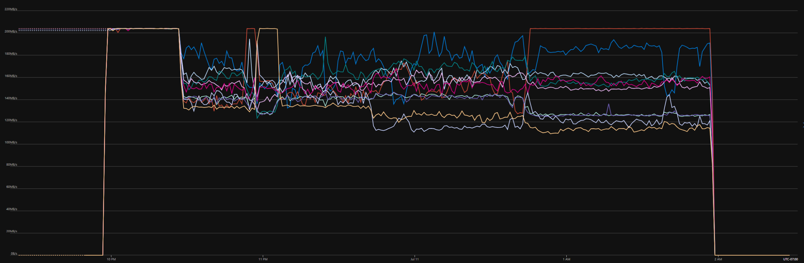

# Overview
This project was created to test IO throughput on the E80ids_v4 instance size.  10 P30 Premium SSD disks will be attached as data disks and a Fio script will be run on the 10 disks.  

The sles_lab.yml or ubuntu_lab.yml Ansible playbooks in the root of the repo will utilize Ansible's Terraform module to create the resources in Azure.  

All resources will be created in a single resource group.  

By default, Node0 is imaged with URN "SUSE:sles-15-sp2:gen2:latest".    

The bellwether.fio script in the scripts directory will be run with Fio.
The Fio test will automatically kick off when the VM boots up. The VM will automatically deallocate when the test is complete.  

A dashboard will be created containing a graph configured with the read metrics for all the disks.  

The console is enabled on the VM.  See Tips section for more SSH information.
# Installation
## Installation in your local Linux environment 
### Links to install requirements
- az CLI
    1. https://docs.microsoft.com/en-us/cli/azure/install-azure-cli-linux?pivots=apt
- Terraform
    1. https://learn.hashicorp.com/tutorials/terraform/install-cli
- Ansible    
    1. https://docs.ansible.com/ansible/latest/installation_guide/intro_installation.html#installing-ansible-on-specific-operating-systems

# Run the playbook
## Login az CLI:
```console
az login
```  
## Clone the repository and run this command from root of project folder:
### If you are running a SLES image:
```console
ansible-playbook -i myazure_rm.yml sles_lab.yml
```  
### If you are running an Ubuntu image:
```console
ansible-playbook -i myazure_rm.yml ubuntu_lab.yml
```  
### Changing the instance size or image
The main.tf in the root of the repo calls the node module to create the nodes
```hcl
module "node0" {
  source = "./modules/node"
  rg = module.rg0.rg
  region = module.network0.region
  subnet = module.network0.subnet
  NSGid = module.NSG0.NSGid
  console = module.storage_account0.console
  size = "Standard_B2ms"     #<-----------------THIS LINE TO CHANGE INSTANCE SIZE 
  publisher = "SUSE"         ###
  offer = "sles-sap-15-sp1"  ###<---------------THESE LINES TO CHANGE IMAGE
  sku = "gen2"               ###
  _version = "latest"        ###
  tag = "node0"
}
```
### The resources will be created in a resource group specified in the root of the repo's main.tf.  
```console
module "rg0" {
  source = "./modules/resource_group"
  rg = "throughput_test"    #<-----------------THIS LINE TO CHANGE RESOURCE GROUP NAME
}
```
### Changing the region
```console
module "network0" {
  source = "./modules/network"
  rg = module.rg0.rg 
  region = "westus2"        #<-----------------THIS LINE TO CHANGE REGION
  address_space = [ "10.0.0.0/16" ]
  address_prefixes = [ "10.0.0.0/24" ]
}
```

# Deleting the environment
### The cluster can be deprovisioned by running:
```console
$ terraform delete
```  
You can also simply delete the resource group the cluster is in.  If you manually delete the resource group, terraform will leave behind the files:
1. terraform.tfstate
1. terraform.tfstate.backup

Delete the tfstate files and you ready to spin up another cluster.  

If you do not want to wait for the previous resource group to be deleted, you can create a new resource group name in main.tf, and the new resources will be spun up in the new resource group.

# Tips

### SSH Keys
If you do not already have SSH keys setup in your home directory, they will be created for you.  The public keys will be installed on both the nodes.  The username you should login with is 'azadmin'.  If you already have SSH keys setup, you can login with your existing keys with the 'azadmin' user, as your existing keys will be distributed to both nodes.

### OS Images
Here are some examples found in /modules/node/variable.tf:
```console
################################
# publisher = "SUSE"
# offer     = "sles-sap-15-sp2"
# sku       = "gen2"
# _version   = "latest"
################################
# publisher = "SUSE"
# offer     = "sles-sap-12-sp5"
# sku       = "gen2"
# _version   = "latest"
################################
# publisher = "Canonical"
# offer     = "UbuntuServer"
# sku       = "18_04-lts-gen2"
# _version   = "latest"
################################
# publisher = "Canonical"
# offer     = "UbuntuServer"
# sku       = "16_04-lts-gen2"
# _version   = "latest"
################################
```

### Dashboard

A dashboard will be created containing a graph of the read IO metrics of all the disks.  The dashboard will be named **Throughput-\<nodename\>**.  It will be created as a shared dashboard, but it can be easily manually changed to private.  The dashboard will not automatically delete itself when the project resource group is deleted if it is set to private.  You must manually delete the dashboard if you set it to private.


### Running multiple versions of this test in parallel
You can clone multiple instances of this project to create multiple VMs for testing. In addition to changing the resource group name, you would have to change the name of the Azure VM resource, which can be done by changing the tag name:
```console
module "node0" {
  source = "./modules/node"
  rg = module.rg0.rg
  region = module.network0.region
  subnet = module.network0.subnet
  NSGid = module.NSG0.NSGid
  console = module.storage_account0.console
  size = "Standard_E80ids_v4"
  publisher = "SUSE"    
  offer = "sles-sap-15-sp2"
  sku = "gen2"
  _version = "latest"
  tag = "node0"            #<-----------------THIS LINE TO CHANGE TAG NAME
}
```
